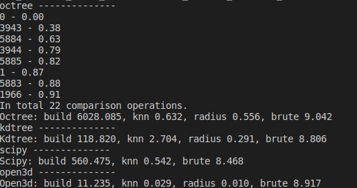
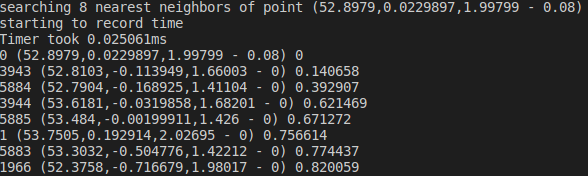

##Nearest Neighbor Problem

---------------

1.**Python implementation**
* it's obvious that using octree and kdtree is significantly faster than brute force. Among different libraries open3d knn is the fastest

    
     
    
Fig1. using different methods to conduct KNN search, with unit ms

 

2. **C++ implementation**
    ~~~c++
    #include <iostream>
    #include <fstream>
    #include <pcl/io/pcd_io.h>
    #include <pcl/point_types.h>
    #include <pcl/visualization/cloud_viewer.h>
    #include <pcl/kdtree/kdtree_flann.h>
    #include <chrono>

    struct Timer {

        std::chrono::high_resolution_clock::time_point start, end;
        std::chrono::duration<float> duration;

        Timer() {
            start = std::chrono::high_resolution_clock::now();
            std::cout<<"starting to record time\n";
        }

        ~Timer() {
            end = std::chrono::high_resolution_clock::now();
            duration = end - start;

            float ms = duration.count() * 1000.0f;
            std::cout << "Timer took " << ms << "ms\n";
        }
    };

    void convertBin2Pcd(const std::string &path, pcl::PointCloud<pcl::PointXYZI>::Ptr point_cloud, const std::string &path2){
        std::fstream inputFile_(path, std::ios::in | std::ios::binary);
        while(inputFile_){
            pcl::PointXYZI point;
            inputFile_.read((char *) &point.x, 3*sizeof(float));
            //inputFile_.read((char *) &point.y, sizeof(float));
            //inputFile_.read((char *) &point.z, sizeof(float));
            inputFile_.read((char *) &point.intensity, sizeof(float));
            point_cloud->push_back(point);
        }
        inputFile_.close();
        pcl::io::savePCDFileBinary(path2, *point_cloud);
        return;      
    }

    void visPointCloud(pcl::PointCloud<pcl::PointXYZI>::Ptr point_cloud){
        pcl::visualization::CloudViewer viewer("Simple Cloud Viewer");
        viewer.showCloud(point_cloud);
        while (!viewer.wasStopped())
        {
        }
        return;
    }

    void pclKnnSearch(pcl::PointCloud<pcl::PointXYZI>::Ptr point_cloud, int K, std::vector<int> &neighborIndices_, std::vector<float> &neighborDistances_){

        pcl::KdTreeFLANN<pcl::PointXYZI> kdtree;
        kdtree.setInputCloud(point_cloud);
        pcl::PointXYZI searchPoint = point_cloud->points[0];
        std::cout<<"searching "<<K<<" nearest neighbors of point "<<searchPoint<<'\n';
        std::unique_ptr<Timer> timer = std::make_unique<Timer>();
        kdtree.nearestKSearch(searchPoint, K, neighborIndices_, neighborDistances_);
        return;
    }

    int main(int argc, char **argv){
        //std::string path = argv[1];
        //std::string outputFile_ = "/home/gfeng/gfeng_ws/point_cloud_processing/ch2_nearest_neighbor_problem/data/0.pcd";
        pcl::PointCloud<pcl::PointXYZI>::Ptr point_cloud(new pcl::PointCloud<pcl::PointXYZI>);
        //convertBin2Pcd(path, point_cloud, outputFile_);
        if(pcl::io::loadPCDFile<pcl::PointXYZI>("/home/gfeng/gfeng_ws/point_cloud_processing/ch2_nearest_neighbor_problem/data/0.pcd", *point_cloud) == -1){
            PCL_ERROR ("Couldn't read file\n");
            return (-1);
        }
        //visPointCloud(point_cloud);
        int K = 8;
        std::vector<int> neighborIndices_(K);
        std::vector<float> neighborDistances_(K);
        pclKnnSearch(point_cloud, K, neighborIndices_, neighborDistances_);

        for(int i = 0;i < K; i++){
            int index = neighborIndices_[i];
            std::cout<<index<<' '<<point_cloud->points[index]<<' '<<neighborDistances_[i]<<'\n';
        }
        return 0;
    }

    
     
    
Fig2. using C++ pcl library to perform KNN search of 8 neighbors, searching took 0.025061ms

